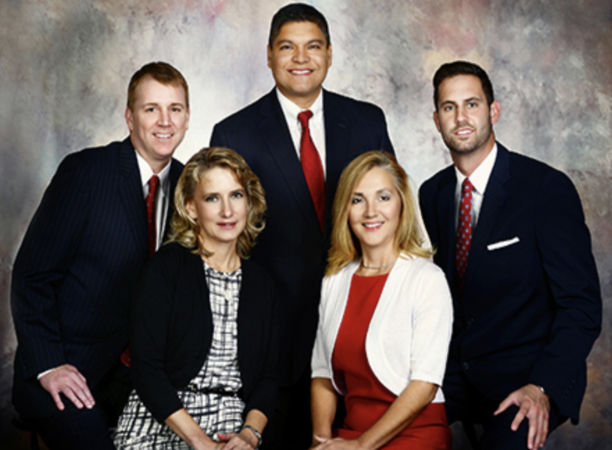
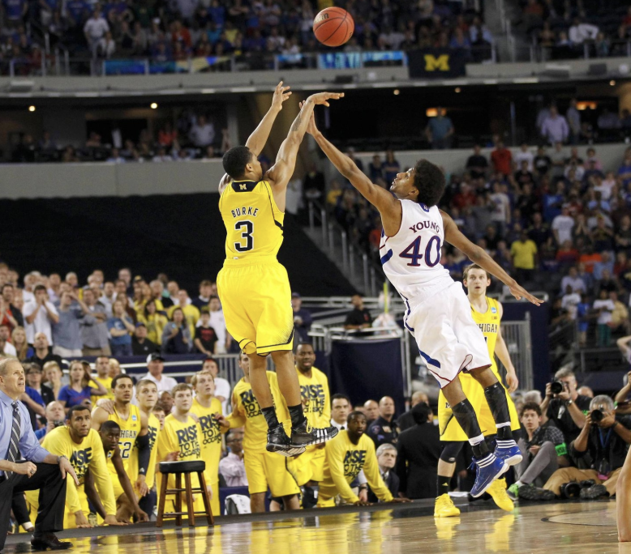
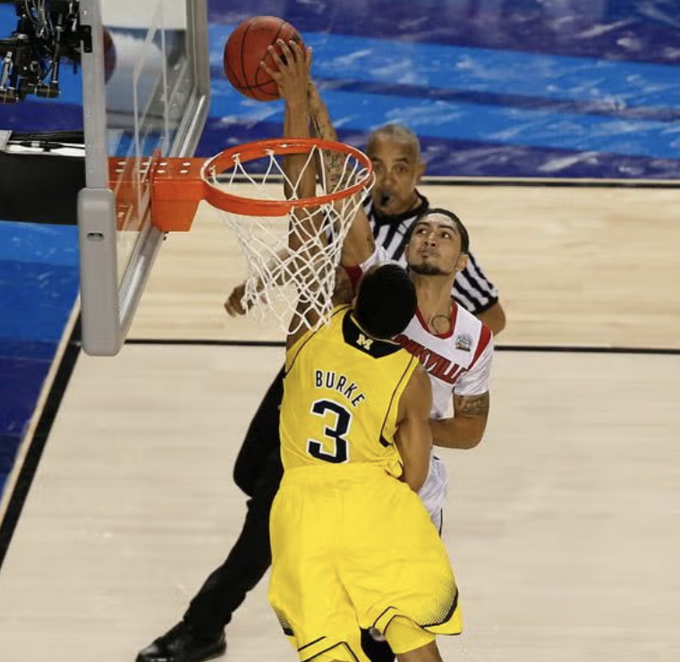
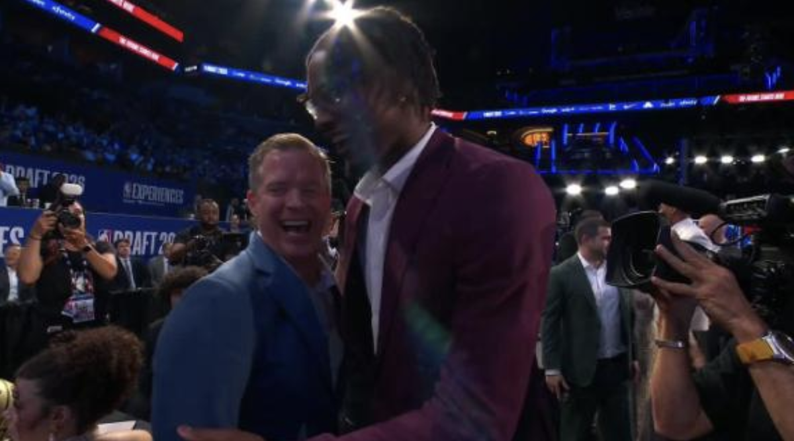

------------------------------------------------------------------------

---
title: "Dusty May"
date: 2026-06-26
---

# The Dusty May Moratorium

*“Thats what happens when you win a title, nothing else matters, all the skeletons and boogeymen just vanish”* - Bill Simmons, yesterday, about the Red Sox, a team that plays a sport I’m still not sure he knows anything about.

I saw my first championship as a basketball fan this year. Not to say that I’m some long suffering fan, my lack of a favorite NBA team cuts my opportunity by at least half. But Michigan, after a lifetime of watching their runs of historic players and coaches losing huge games, did it. It was 6 am for me when they won, I was in a foreign land watching a team no Czech person has ever heard of. I was also watching without my dad, who didn't study abroad with me, the first huge Michigan game I can think of watching without him.

\
My dad and I are pretty greedy fans, so not even 24 hours after the net was cut we started mocking next year's roster, all pivoting around our genius Xs & Os recruit salesmen head coach Dusty May. He was the white knight. But in the middle of my 3 month celebration of the best college basketball team I’ve ever watched, the college basketball landscape presented him with greener pastures in Dallas with Cooper Flagg. So now, over the next 3 months I'll put Bill Simmons' quote to the test.

### It starts with one simple exercise, did the Boogeymen actually vanish?

Luke Hancock, pictured on the right of what looks to be an admittedly pretty hilarious sit-com cast, but is actually the partner's photo at his branch of Raymond James. This seemingly innocuous financier averaged 8 points a game on Louisville's 2013 National Championship team. Except for the finals versus Michigan, where he scored FOURTEEN straight points, out of a total 22 for the game. He absorbs much of my blame for Michigan's all time greatest player and coach, Trey Burke and John Belien, not securing a ring. This was the first year I ever watched Michigan basketball, Trey Burke was the first player I knew, my dad tackling me to the ground as his shot went in against Kansas, was the first moment I remember. In the same way Luke Hancock's performance doesn't make that year all for naught, our championship in 2026 doesn't erase this loss from memory. **Verdict: No, he did not vanish.**

{fig-align="center" width="375"}

Here's Trey Burke hitting an all time great 3 and making an all time great block →

{width="297"}

{width="294"}

\
The very year after Luke had his game, Aaron Harrison hit a shot way more damning than any that Hancock hit. A deep 3 point buzzer beater more reminiscent of the Trey Burke shot than anything else. By my count, he and his brother hit 6 of these shots, and Michigan was just a benchmark in their trail of tears. Many could argue that this succeeding the finals loss adds insult to injury, but I think my heart had formed calices by that point. **Verdict: Yes, he vanished.**

None as boogey-ish as Hancock, but there are a few more boogeymen to cover. When thinking of Hancock, the Michigan mind immediately jumps over to Donte DiVincenzo, the other bench player turned white hot final four flamethrower. 5 years after the first one, this run felt like a redux of my introduction to Michigan basketball. An iconic shot (saving Rob Gray from being mentioned on the boogeymen list), accompanied by being pancaked by my dad. Another Michigan icon, Moe Wagner, taking an obviously underseeded team to a national championship. And in that national championship, a bench player – although two time NBA champion (one by proxy) rather than Louisville area financial planner – having a career game, against Michigan. A run, and a season, with so much more good than bad. Not only were there moments that I'll remember far more than a finals loss to the second best college basketball team I’ve ever seen, but all this game did was let me know we’d be hanging around with our great coach John Beilein for a long time. **Verdict: Yes.**

The elephant in the room – a colloquial way of saying the big thing that we probably shouldn't ignore anymore – probably shouldn't be ignored anymore. Yes John Beilein left for the NBA, yes it was the last time before yesterday that a coach did that. Yes Jim Harbaugh, also jaded by the nature of college sports, a mere season after dominating it, did the same thing. If you close your eyes to the sport it looks even more similar than Beilein. The Jim Harbaugh one stung less, the 2023 team was so triumphant and clearly reached its peak of a 3 year run. He didn't leave for the bright lights because Michigan was a stepping stone, and neither did John Belien, he became antagonized by the NCAA and Belien, sensing his career coming to a close, got curious about a new challenge. **Verdict: I'm not even sure they were boogeyman moments to begin with.**

And then they hired Juwan Howard and Sherrone Moore. You can't start a sentence with and, just like you can't sleep with your staffers or punch another coach. Juwan Howard started out where we left off, with a number 1 seed and an Elite 8 appearance. 3 years later after some of the most forgettable rosters in Michigan history, and some cool Chaundee Brown corner 3s, he went 8 and 24, let his assistant take the reins at coach because he was in his home town, and accosted Greg Gard after a 14 point loss in Madison. The coolest part about the Juwan Howard era was the 2019 domination of Gonzaga that put the college basketball world on notice. It was the least interested I've ever been in Michigan basketball, Eli Brooks was sent off with a cool win versus 3 seed Tennessee, and besides that it was forgettable players, forgettable wins, and certainly forgettable losses. **Verdict: No, still kind of annoyed**

Overall, I think Simmons had a pretty solid theory. There is a way to apply this championship to Trey Burke, Nik Stauskas, Moe Wagner, Jordan Poole, Zavier Simpson, Muhammad Ali Abdur Rahkman, and so many more, I'm no Mamdani. Every player and coach of the last 15 years played a part in this, but as I mentioned before, I'm greedy. I wish this was my third championship. I wish Dusty May was here to build a dynasty. It's now clear to me that after watching him look so at home at the NBA draft, that this was always going to happen. **If I never see another championship and Dusty May becomes a boogeyman, I think this one will always be worth his tenure here.**

{width="697"}
